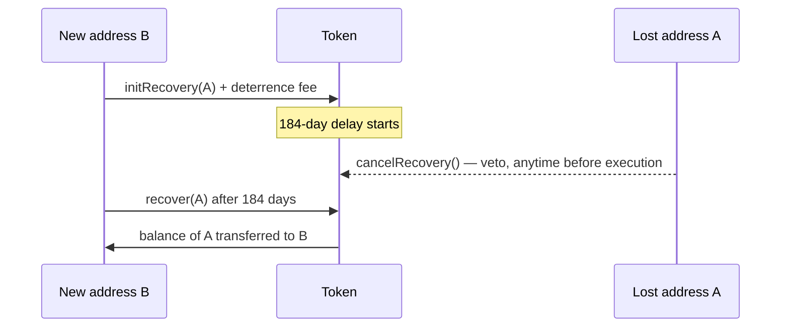

# Recovery Mechanism

Documentation for the token recovery mechanism implemented in [Recoverable.sol](../contracts/shares/base/Recoverable.sol), a base contract of [Shares](../contracts/shares/base/Shares.sol).

## Motivation

It is desirable that share tokens (which legally represent the company's equity) do not get "lost" if a shareholder loses the private key to their account or accidentally sends them to an invalid address. While some issuers address this by adding a back-door to their smart contract, giving them full control over all tokens, we prefer a decentralized approach, as also recommended by the Swiss Blockchain Federation in their [Security Token Circular](https://blockchainfederation.ch/wp-content/uploads/2021/10/SBF-2021-01-Ledger_Based_Securities_2021-10-12.pdf). The issuer can never silently move or destroy a holder's tokens. Every recovery is announced on-chain and subject to a long veto window during which the affected holder can stop it.

In contrast to earlier versions, recovery is now built directly into the token. There is no separate recovery hub and no collateral to stake.

## Process

Assume Alice lost the key to her address A. She picks a new address B and makes all calls from there.

1. From B, Alice calls `initRecovery(A)`, paying a small deterrence fee in the chain's native currency (forwarded to the issuer). This records a recovery that would send the balance of A to B. Anyone can initiate a recovery, but only to a recipient they name — the deterrence fee is there to make spurious recoveries costly.
2. A delay of 184 days (`RECOVERY_DELAY`) must pass. The delay is chosen in analogy to the 6-month annulment period for lost securities under Swiss Code of Obligations [art. 983](https://www.fedlex.admin.ch/eli/cc/27/317_321_377/de#art_983).
3. After the delay, anyone calls `recover(A)` and the balance is transferred to B.

## Protection of the rightful owner

The whole point of the delay is to give the rightful owner time to object. If the key is found again, or the recovery was started maliciously, the holder of the "lost" address calls `cancelRecovery()` from that address at any time before execution, which deletes the pending recovery. The issuer can also cancel any recovery via `cancelRecovery(lostAddress)`, and the owner of a contract-typed holder can cancel a recovery targeting it via `cancelRecoveryOnOwnedContract`.

Only one recovery can be pending per address at a time. A holder who is unsure whether a recovery is pending against their address can read the public `recoveries` mapping.

## Burning instead of recovering

The issuer can also use the same time-locked machinery to cancel tokens rather than move them. `initBurn(target)` (issuer only) starts the 184-day clock, and `burn(target)` destroys the balance once it has elapsed. Like a recovery, a pending burn can be vetoed by the affected holder with `cancelRecovery()`. Burning can indicate that the underlying shares were cancelled, or be a preparatory step for re-issuing them in a different form or on a different chain.
