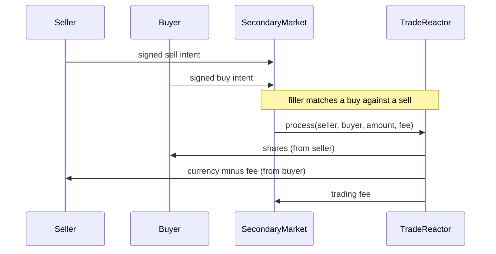

# Secondary Market

Documentation for the peer-to-peer trading system made up of [SecondaryMarket](../contracts/market/SecondaryMarket.sol) and [TradeReactor](../contracts/market/TradeReactor.sol). Where the [Direct Investment](market.md) contract is the issuer's primary-issuance counter, the secondary market is where existing shareholders trade with each other.

## Overview

Trading is intent-based. A buyer or seller signs an order ("intent") off-chain; nothing is locked up. A filler then matches a buy intent against a sell intent and submits both to the on-chain reactor, which verifies the signatures and the price and atomically swaps the tokens. Holders keep custody of their tokens until the moment a trade executes — the only on-chain commitment is an ERC-20 allowance to the reactor.

## Intents

An intent is a signed order to exchange `amountOut` of `tokenOut` for at least `amountIn` of `tokenIn`, valid between `creation` and `expiration`. `SecondaryMarket.createBuyOrder` and `createSellOrder` build the correct intent for a given market, where one side is always the share `TOKEN` and the other the `CURRENCY`. Intents are signed using EIP-712 and verified by the reactor; they are never stored on-chain as state. An intent may name a `filler`, in which case only that contract may forward it.

Orders can be made public by calling `placeOrder`, which emits the intent as an event so any allowed filler can pick it up, or they can be sent to the configured filler directly. There is no privacy difference between the two — every fill is recorded on-chain regardless.

## Matching and Price

A buy and a sell match when the bid is at least the ask (`verifyPriceMatch`). When they do, the trade executes at the **earlier** order's price: whoever posted first gets their exact price, and any price improvement accrues to them rather than to the filler. All price calculations round in favour of the intent owner to avoid rounding exploits.

Intents fill partially. The reactor tracks the filled amount per intent hash, so a large order can be matched against several smaller ones over time until it is exhausted, and never beyond (`OverFilled`). An owner or filler can cancel an intent with `cancelIntent`, which marks it fully filled.

## Fees

A trading fee is charged to the seller — the buyer pays the full price, the seller receives the price minus the fee. The default is 1.9% (`tradingFeeBips`), and the issuer commits to never setting it above 5%. The fee collected on each trade goes to the filler and accumulates in the SecondaryMarket contract. `withdrawFees` splits the accumulated fees between the issuer and Aktionariat according to `licenseShare` (default 50%), settling the software licence fee in the same transaction.

## Control

The market is operated by the issuer. It can be opened and closed (`open` / `close`), and a trusted `router` can be configured: if set, only that router may call `process`. Pinning a router prevents front-running, since no one else can submit a different matching of the same orders. With no router configured, anyone can act as filler.
