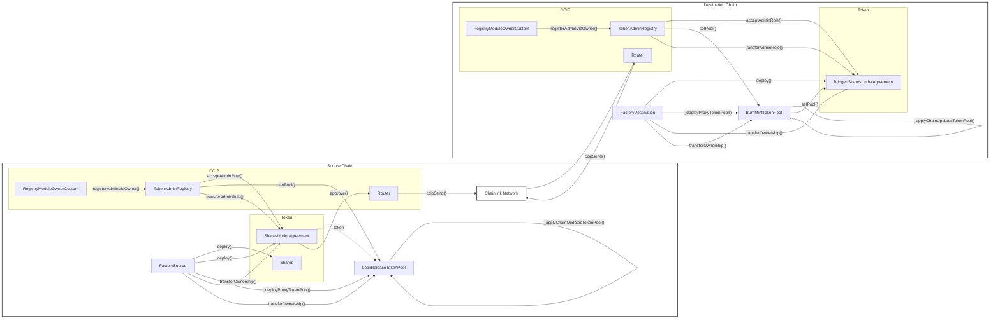

# Aktionariat CCIP

Aktionariat leverages Chainlink CCIP infrastructure to enable cross chain token transfers.

## Architecture

The architecture follows the standard Chainlink Infrastructure setup, with the slight difference that the token pool is proxied.
We then allow for rate limit of both `capacity` and `rate` of zero, to temporarily deactivate outgoing transfers through the bridge.
The architecture is as follows:



We brought over token pool code to add proxy initialization that follows exactly the constructor procedure.
You can find custom token pools within the `contracts/vendor/@chainlink` folder.

## Actions

The CCIP infrastructure enables tokens to be bridged, back and forth and to halt the bridge for outgoing transfers utilities on the TokenPool have been added to enable the functionality.

Moreover, there is functionality to add destination chains after the deployment, and manage other related TokenPool standard settings.
These are not covered by our hardhat tasks CLI.

## Testnet Tests

To run testnet tests we provided utilities to interact with networks, deploy tokens and manage contracts.
The following Hardhat tasks are designed for the CCIP testing infrastructure, as such the default network used are `sepolia` and `baseSepolia`.
To change them, we provide CLI flags, custom defined for RPCs, and the common `--network` provided by Hardhat to manage the network.

To get help with an hardhat tasks, run `npx hardhat help <task-name>`.

To deploy Shares, SHA (Bridged SHA on destination), LockReleaseTokenPool logics (BurnMintTokenPool on destination) on source chain, the source chain factory contract (destination factory on destination) and deploy a first token, run:

```sh
npx hardhat deploy-factory-share
```

or

```sh
npx hardhat ccip-estimate-deployment-gas
	--source [source-network]
	--destination [destination-network]
	--sha [sha-address]
	--bsha [bsha-address]
	--nonce
```

Both `source` and `destination` are optional, if omitted they default to `sepolia` and `baseSepolia` respectively.
If you get a deployment error, when deploying multiple times, consider using the flag `--nonce` to increase the nonce to rotate proxies addresses.

Then given Shares and SHA contract address you would want to first mint some Shares, and wrap them to SharesUnderAgreement (sha):

```sh
npx hardhat mint-wrap-shares
	--network sepolia
	--shares [shares-address]
	--sha [sha-address]
```

You should add the shares token contract and the sha token contract that you just deployed.
Extended comand is:

```sh
npx hardhat mint-wrap-shares
	--shares [shares-address]
	--sha [sha-address]
	--amount [quantity]
	--to [receiver-address]
	--network [network-to-mint-on]
```

Then to bridge tokens from `sepolia` to `baseSepolia`:

```sh
npx hardhat ccip-bridge
	--sha [sha-address]
```

Extended comand is:

```sh
npx hardhat ccip-bridge
	--sha [sha-address]
	--amount [amount-to-bridge]
	--source [source-network]
	--destination [destination-network]
	--to [receiver-on-destination]
```

If you wish you can halt/activate the bridge through:

```sh
npx hardhat ccip-manage-bridge
	--stkp [address-source-token-pool]
	--halt
```

This will halt the bridge from `sepolia` to `baseSepolia`, if you wish to activate it back run the same command without `--halt`

Extended comand is:

```sh
npx hardhat ccip-manage-bridge
	--source [source-network]
	--destination [destination-network]
	--stkp [address-source-token-pool]
	--reset
```

Consider using `--reset` if using this command multiple times.
