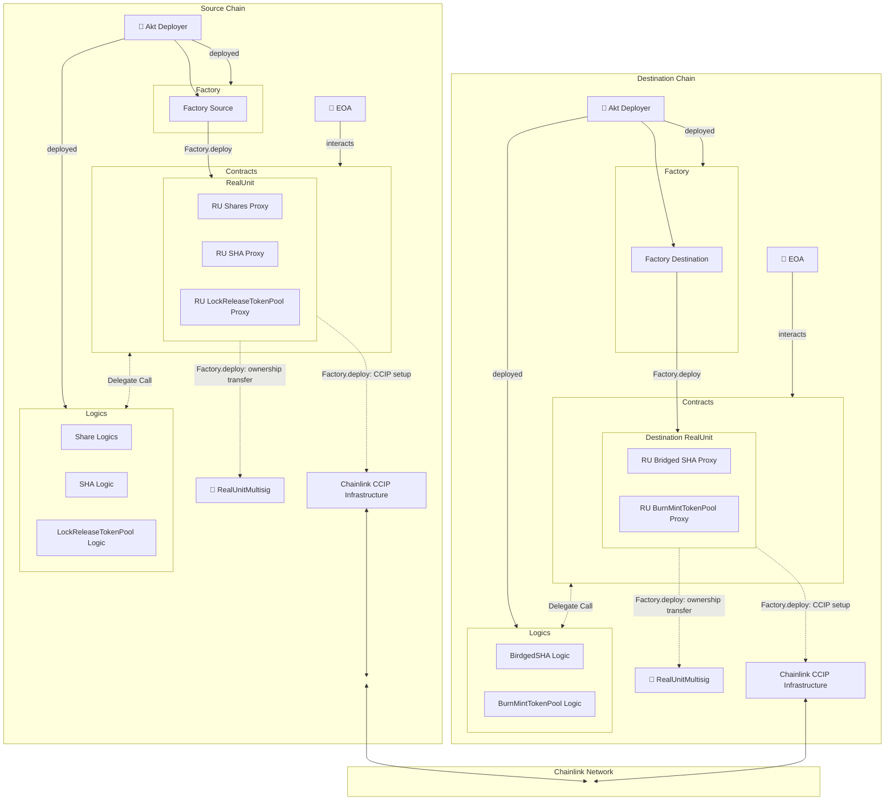

# Deployment

The deployment is handled through factories, `FactoryDestination.sol` and `FactorySource.sol` within the `contracts/factories` folder.
The flow can be described by the following chart:

## Deployment Flow

The flow is as is:

1. The Aktionariat Deployer has to deploy all contracts' logics used by proxies.
2. The Aktionariat Deployer has to deploy the factory
   2.1. The Aktionariat calls `deploy` with token informations
   2.2. Factory deploys Proxies for tokens and CCIP Token Pool.
   2.3. Connects connects to the CCIP infrastructure.
   2.4. Transfer ownership of Proxies to a designed `futureOwner`.

Steps 1 and 2 have to be performed only once, each chain, then the deployment consits of calling the `deploy` function on source and any desired destination chain.
