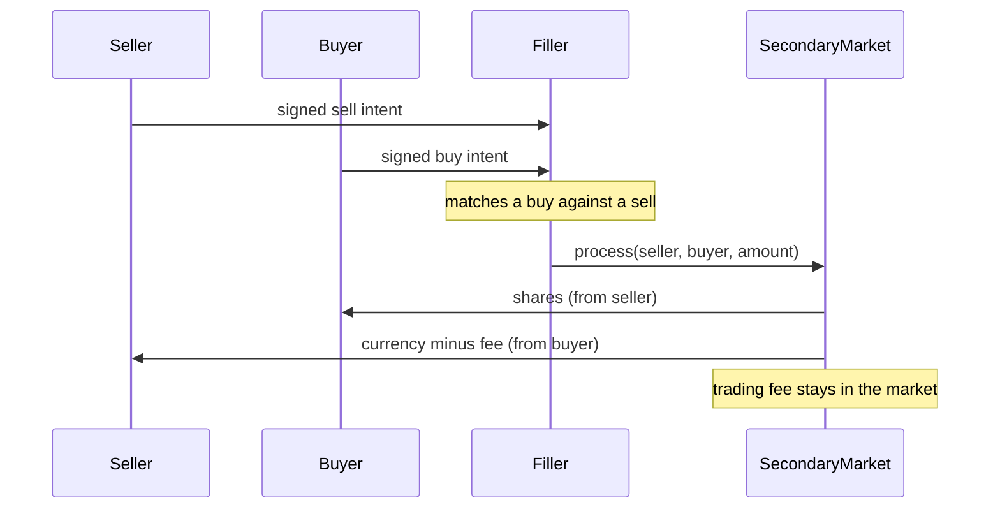

# Secondary Market

Documentation for the peer-to-peer trading system, the [SecondaryMarket](../contracts/market/SecondaryMarket.sol) contract. Where the [Direct Investment](market.md) contract is the issuer's primary-issuance counter, the secondary market is where existing shareholders trade with each other. There is one market per token and currency pair, deployed by the issuer through the [SecondaryMarketFactory](../contracts/market/SecondaryMarketFactory.sol).

## Overview

Trading is intent-based. A buyer or seller signs an order ("intent") off-chain; nothing is locked up. A filler then matches a buy intent against a sell intent and submits both to the market, which verifies the signatures and the price and atomically swaps the tokens. Holders keep custody of their tokens until the moment a trade executes — the only on-chain commitment is an ERC-20 allowance to the market.

## Intents

An intent is a signed order to give `amountOut` of `tokenOut` for `amountIn` of `tokenIn`, valid between `creation` and `expiration`. `SecondaryMarket.createBuyOrder` and `createSellOrder` build the correct intent for a given market, where one side is always the share `TOKEN` and the other the `CURRENCY`. Intents are signed using EIP-712 with the market as the verifying contract, so an intent is valid on exactly one market. They are never stored on-chain as state.

Which side an intent is on follows from its tokens: an intent giving `TOKEN` is a sell and can only ever be processed as one, an intent giving `CURRENCY` is a buy. Its filled amount is therefore always counted in tokens, and it can never be filled beyond the signed maximum. `creation` may not lie in the future, because the later of two matching intents takes the spread (see below).

An intent may name a `filler`, in which case only that address may submit it to `process`. With the zero address, anyone may submit a match; the submitter decides nothing but the pairing and the amount, so this is safe.

Orders can be made public by calling `placeOrder`, which emits the intent as an event so any allowed filler can pick it up, or they can be sent to the configured filler directly. There is no privacy difference between the two — every fill is recorded on-chain regardless.

## Matching and Price

A buy and a sell match when the bid is at least the ask (`verifyPriceMatch`). When they do, the trade executes at the **earlier** order's price: whoever posted first gets their exact price, and any price improvement accrues to the later order rather than to the filler. All price calculations round in favour of the intent owner to avoid rounding exploits.

Intents fill partially. The market tracks the filled amount per intent hash, so a large order can be matched against several smaller ones over time until it is exhausted, and never beyond (`OverFilled`). The intent owner, the named filler, the router and the market owner can cancel an intent with `cancelIntent`, which marks it fully filled.

## Fees

A trading fee is charged to the seller — the buyer pays the full price, the seller receives the price minus the fee. The market computes the fee itself from `tradingFeeBips` (default 1.9%) at execution time; the submitter has no say in it. The issuer commits to never setting it above 5% (`MAX_TRADING_FEE_BIPS`), and a seller prices the fee into the ask knowing this ceiling; the rate is not part of the signed intent. The fee accumulates in the SecondaryMarket contract. `withdrawFees` splits the accumulated fees between the issuer and Aktionariat according to `licenseShare` (default 50%), settling the software licence fee in the same transaction.

## Control

The market is operated by the issuer. It can be opened and closed (`open` / `close`), and a trusted `router` can be configured: if set, only that router may call `process`. Pinning a router prevents front-running, since no one else can submit a different matching of the same orders. With no router configured, anyone can act as filler.

Under transfer restrictions the market must be typed Admin on the token, like every intermediary (see [allowlist.md](allowlist.md)): sold tokens pass through the market on their way to the buyer, who becomes Allowed on arrival.
